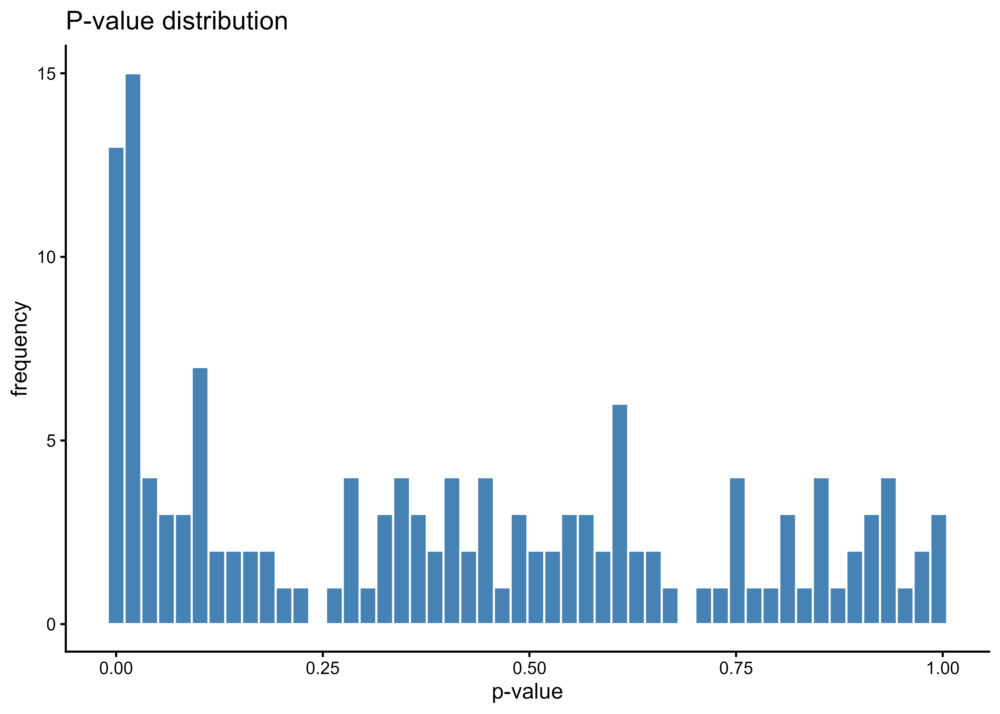
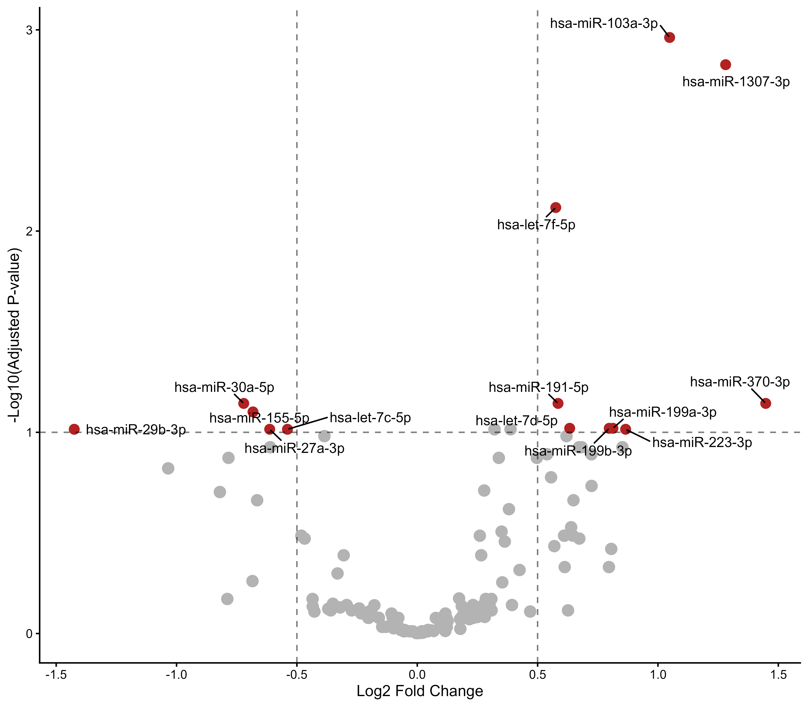
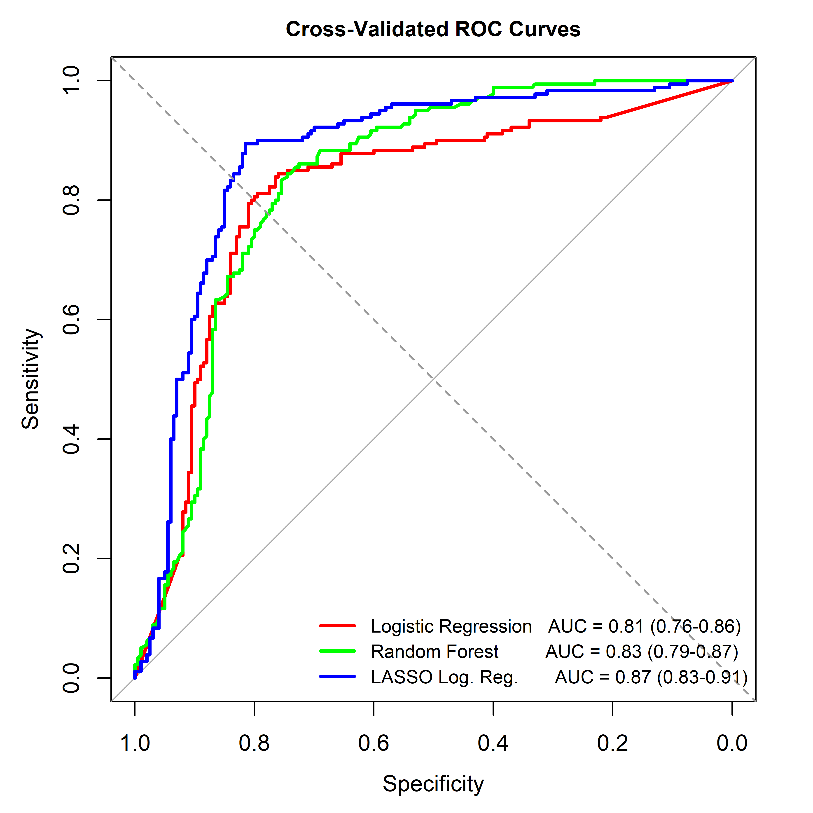
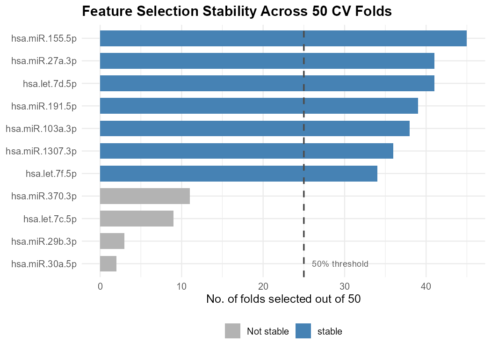

# Schizophrenia Exosomal miRNA Biomarker Discovery Pipeline

### Integrated Differential Expression and Machine Learning Analysis of Plasma Exosomal miRNAs in First-Episode Schizophrenia

## Overview

This repository contains an end-to-end bioinformatics and machine learning workflow for the identification of candidate plasma exosomal miRNA biomarkers associated with First-Episode Schizophrenia (FES).

The pipeline integrates small RNA sequencing preprocessing, miRNA quantification, count matrix construction, differential expression analysis, machine learning-based feature prioritization, target prediction, protein-protein interaction network analysis, and functional enrichment analysis.

The primary objective is to identify dysregulated plasma exosomal miRNAs and investigate their potential biological relevance in schizophrenia pathogenesis.

This repository focuses on computational methodology, reproducibility, and workflow implementation. Raw sequencing files, count matrices, and intermediate outputs are intentionally excluded.

---

## Project Highlights

* Analysis of publicly available plasma exosomal small RNA-seq datasets
* Quality control and preprocessing using Galaxy
* miRNA quantification using miRDeep2
* Differential expression analysis using DESeq2
* Machine learning-based biomarker prioritization using Random Forest and LASSO
* Protein-protein interaction network analysis using Cytoscape
* GO and KEGG pathway enrichment analysis
* Reproducible workflow using R and Python

---

## Data Acquisition

Small RNA sequencing datasets were obtained from the NCBI Gene Expression Omnibus (GEO).

Datasets used:

- [GSE228881](https://www.ncbi.nlm.nih.gov/geo/query/acc.cgi?acc=GSE228881)
- [GSE292347](https://www.ncbi.nlm.nih.gov/geo/query/acc.cgi?acc=GSE292347)

Biological source:

* Plasma-derived exosomes

Sequencing platform:

* Illumina NovaSeq 6000

Data type:

* Single-end small RNA sequencing

Following preprocessing and quality filtering, 38 samples were retained for analysis:

* 18 First-Episode Schizophrenia (FES) (after filtering)
* 20 Healthy Controls (HC)

---

## Data Availability and Privacy

To support reproducible research practices and maintain repository efficiency, the following files are intentionally excluded:

* Raw FASTQ files
* miRDeep2 quantification outputs
* Count matrices
* Sample-level metadata
* Intermediate analysis files
* Processed expression datasets

Users interested in reproducing the analysis should obtain the original datasets directly from GEO and execute the workflow using the provided scripts.

Only workflow code, documentation, and representative visualizations are included in this repository.

---

## Computational Workflow

```text
GEO Small RNA-Seq Datasets
            │
            ▼
Quality Control & Adapter Trimming
(Fastp via Galaxy)
            │
            ▼
miRNA Mapping & Quantification
(miRDeep2 Mapper & Quantifier via Galaxy)
            │
            ▼
Count Matrix Construction
(Python / Google Colab)
            │
            ▼
Differential Expression Analysis
(DESeq2 in R)
            │
            ▼
Feature Selection & Stability Analysis
(Random Forest + LASSO)
            │
            ▼
Candidate Biomarker Prioritization
            │
            ▼
Target Prediction
(miRDB)
            │
            ▼
Protein-Protein Interaction Network
(Cytoscape)
            │
            ▼
Hub Gene Identification
            │
            ▼
GO Enrichment Analysis
            │
            ▼
KEGG Pathway Enrichment
            │
            ▼
Biological Interpretation
```

---

## Repository Structure

```text
.
├── plots/
│
├── 01miRNA_count_matrix_construction.ipynb
├── 02mirna_deseq2_analysis.Rmd
├── 03miRNA_ML_analysis.Rmd
├── 04_functional_enrichment.Rmd
│
├── README.md
└── .gitignore
```

---

## Methodology

### 1. Quality Control and Preprocessing

All preprocessing steps were performed using the Galaxy bioinformatics platform.

Tool used:

* Fastp

Objectives:

* Adapter trimming
* Quality filtering
* Removal of low-quality reads
* Filtering of short sequencing fragments

---

### 2. miRNA Mapping and Quantification

Tools used:

* miRDeep2 Mapper
* miRDeep2 Quantifier

Objectives:

* Collapse identical reads
* Map reads to reference sequences
* Quantify mature miRNA expression
* Generate per-sample miRNA count tables

Samples with insufficient mapped miRNA reads after preprocessing and quantification were excluded from downstream analysis.

---

### 3. Count Matrix Construction

miRDeep2 quantifier outputs were processed using Python in Google Colab.

Processing steps:

1. Import sample-specific quantification files
2. Extract mature miRNA identifiers and counts
3. Merge all samples into a unified expression matrix
4. Handle missing values
5. Aggregate duplicated miRNA entries
6. Convert counts into integer format

Output:

```text
miRNA_countmatrix.csv
```

Rows represent miRNAs and columns represent samples.

---

### 4. Differential Expression Analysis

Differential expression analysis was performed using DESeq2 in R.

Key procedures:

* Size factor normalization
* Dispersion estimation
* Negative binomial modelling
* Wald statistical testing
* Multiple testing correction

Filtering criteria:

* Adjusted p-value < 0.10
* |Log₂ Fold Change| > 0.5

Outputs:

* Differentially expressed miRNAs
* Log₂ fold changes
* Adjusted p-values
* PCA visualization
* Volcano plots

---

### 5. Machine Learning Analysis

Machine learning models were applied to prioritize robust candidate biomarkers.

Algorithms:

* Random Forest
* LASSO Logistic Regression

Objectives:

* Feature importance estimation
* Biomarker prioritization
* Stability analysis
* Classification performance evaluation

Representative outputs:

* ROC curves
* Feature importance plots
* Feature stability analysis

---

### 6. Target Prediction

Target genes were identified using miRDB.

Selection criteria:

* High-confidence target predictions
* Target score > 80

---

### 7. Protein-Protein Interaction Network Analysis

Protein interaction networks were constructed using Cytoscape.

Objectives:

* Explore functional relationships
* Identify highly connected nodes
* Detect potential hub genes

---

### 8. Functional Enrichment Analysis

Functional enrichment analysis was performed using clusterProfiler.

Analyses:

* Gene Ontology (GO)
* KEGG Pathway Enrichment

Purpose:

* Identify enriched biological processes
* Investigate molecular pathways potentially associated with schizophrenia

---

## Technology Stack

### Workflow Platform

* Galaxy

### Bioinformatics Tools

* Fastp
* miRDeep2
* DESeq2
* miRDB
* Cytoscape
* clusterProfiler

### Programming Languages

* R
* Python

### Machine Learning

* Random Forest
* LASSO Logistic Regression
* Cross Validation
* Feature Stability Analysis

### Visualization

* ggplot2
* EnhancedVolcano
* pheatmap

---

## Representative Outputs

The repository contains representative outputs generated by the workflow:

* P-value Distribution plot
* Volcano plots
* ROC curves
* Feature stability plots
* GO enrichment plots
* KEGG pathway enrichment plots

<h3 align="center">P-value Distribution Plot</h3>

<p align="center">
  
</p>

<h3 align="center">Volcano Plot</h3>

<p align="center">
  
</p>

<h3 align="center">ROC Curve</h3>

<p align="center">
  
</p>

<h3 align="center">Feature Stability Analysis</h3>

<p align="center">
  
</p>
---

## Reproducibility

To reproduce the workflow:

1. Download sequencing datasets from GEO.
2. Perform quality control using Fastp on Galaxy.
3. Quantify miRNA expression using miRDeep2.
4. Construct the count matrix using the provided Python notebook.
5. Execute DESeq2 differential expression analysis.
6. Perform machine learning-based biomarker prioritization.
7. Conduct target prediction, network analysis, and functional enrichment.

---

## Limitations

* Relatively small sample size.
* Public datasets may contain biological heterogeneity and batch effects.
* Findings are computational and exploratory.
* Experimental validation is required before clinical translation.

---

## Future Directions

* Validation using independent cohorts
* Experimental confirmation through qRT-PCR
* Multi-marker diagnostic model development
* Integration with transcriptomic and clinical datasets

---

## Author

**Isra Aman Aziz**
- M.Sc. Bioinformatics
- Babasaheb Bhimrao Ambedkar University, Lucknow, India
